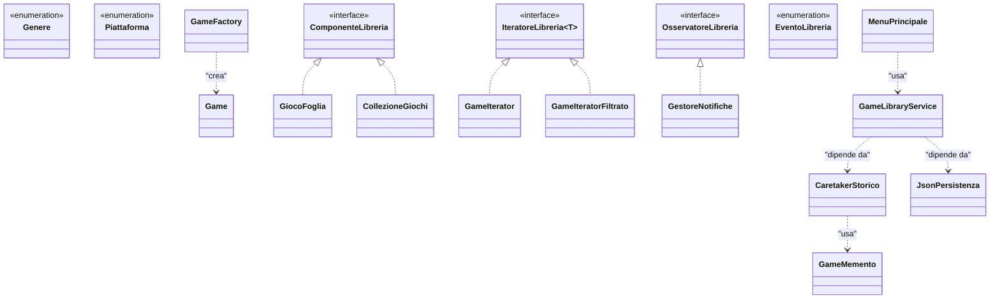
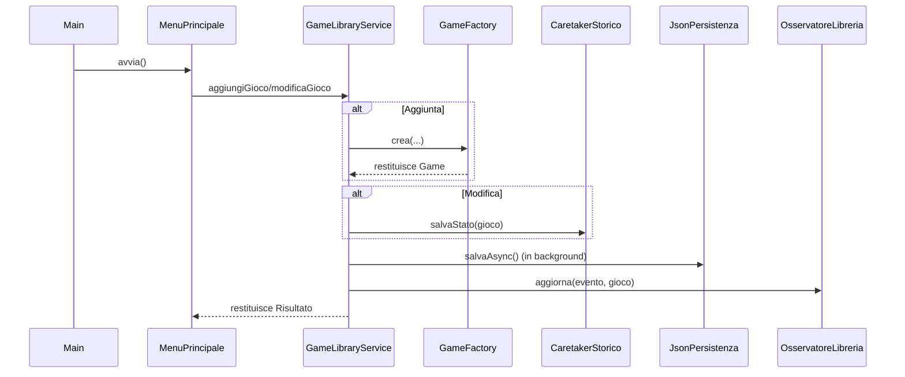

# Game Library Manager

**Game Library Manager** è un'applicazione a riga di comando in Java (versione 21) sviluppata per la gestione di una libreria di videogiochi.
È un progetto universitario realizzato con l'obiettivo di mettere in pratica i principi della programmazione orientata agli oggetti, l'implementazione di design pattern strutturali e comportamentali, e l'utilizzo di strumenti come Maven per il build management e file JSON per la persistenza.

---

## Struttura del Progetto

Di seguito l'albero dei package principali dell'applicazione:

- `com.gamelibrary.composite` — gestisce la trattazione uniforme di giochi singoli e intere collezioni.
- `com.gamelibrary.exceptions` — contiene le eccezioni personalizzate utilizzate per la gestione degli errori di dominio e di sistema.
- `com.gamelibrary.factory` — incapsula la logica di creazione e validazione delle istanze di gioco.
- `com.gamelibrary.iterator` — implementa l'attraversamento e il filtraggio della collezione dei giochi in modo incapsulato e sicuro.
- `com.gamelibrary.memento` — fornisce la logica per il salvataggio e il ripristino dello stato precedente di un gioco (funzionalità Undo).
- `com.gamelibrary.model` — definisce le classi del dominio applicativo (Game, Piattaforma, Genere).
- `com.gamelibrary.observer` — implementa un sistema di notifica eventi disaccoppiato dal flusso di business principale.
- `com.gamelibrary.persistence` — gestisce la persistenza dei dati tramite la serializzazione in formato JSON (utilizzando la libreria Gson).
- `com.gamelibrary.service` — contiene la logica di business e funge da intermediario tra l'interfaccia utente e i dati.
- `com.gamelibrary.ui` — gestisce l'interfaccia a riga di comando (CLI) per l'interazione con l'utente.
- `com.gamelibrary.util` — fornisce classi di utilità per il calcolo delle statistiche e la validazione formale degli input.

---

## Come si avvia

Il progetto usa **Maven**. Basta avere installato Java 21 e Maven.

### Compilazione e Test
Per compilare tutto e far partire i test, apri il terminale nella cartella del progetto e scrivi:
```bash
mvn clean test
```

### Creare l'eseguibile
Per creare il file `.jar` che contiene tutto (anche le librerie esterne come Gson):
```bash
mvn clean package
```

### Avviare l'app
Dopo aver creato il jar, si lancia così:
```bash
java -jar target/game-library-manager-1.0-SNAPSHOT-jar-with-dependencies.jar
```

### Generare il Javadoc
Se ti serve generare la documentazione HTML in automatico:
```bash
mvn javadoc:javadoc
```

---

## Design Pattern usati

Di seguito i pattern progettuali implementati e le motivazioni della loro scelta:

### 1. Factory Pattern
- **Dove si trova:** `GameFactory`
- **Motivazione:** La creazione di un'istanza di gioco e la relativa validazione dei dati avrebbero appesantito eccessivamente il costruttore della classe Model. La responsabilità costruttiva è stata delegata a una Factory dedicata, migliorando la leggibilità e accentrando il controllo degli errori (attraverso un'eccezione dedicata in caso di validazione fallita).

### 2. Composite Pattern
- **Dove si trova:** `ComponenteLibreria`, `GiocoFoglia`, `CollezioneGiochi`
- **Motivazione:** Si è resa necessaria la possibilità di trattare in modo uniforme singoli giochi e raggruppamenti (collezioni). Questo pattern permette di applicare operazioni ricorsive (come il calcolo del totale degli elementi) in maniera trasparente, senza dover distinguere esplicitamente tra nodo e foglia tramite costrutti condizionali.

### 3. Iterator Pattern
- **Dove si trova:** `IteratoreLibreria`, `GameIterator`, `GameIteratorFiltrato`
- **Motivazione:** Per iterare sulla collezione di giochi applicando specifici filtri (es. per piattaforma o per genere) si è adottato questo pattern. Ciò garantisce che l'iterazione avvenga in sicurezza, senza esporre la struttura dati sottostante o rischiare modifiche accidentali concorrenti.

### 4. Builder Pattern
- **Dove si trova:** All'interno della classe `Game`
- **Motivazione:** Considerato l'elevato numero di parametri necessari per l'inizializzazione di un oggetto gioco, un costruttore classico avrebbe richiesto molti argomenti posizionali, riducendo la leggibilità del codice. L'uso di un Builder fluent rende chiara ed esplicita la fase di popolamento dei campi.

### 5. Observer Pattern
- **Dove si trova:** `OsservatoreLibreria`, `GestoreNotifiche`
- **Motivazione:** È stato implementato per disaccoppiare la logica di business dalla gestione delle notifiche (es. log o stampe su standard output). Il service notifica i cambiamenti di stato agli osservatori registrati in maniera asincrona o sincrona, senza accoppiarsi strettamente all'implementazione della view.

### 6. Memento Pattern
- **Dove si trova:** `CaretakerStorico`, `Game.GameMemento`
- **Motivazione:** Utilizzato per supportare la funzionalità di annullamento (Undo) delle operazioni. Permette di salvare lo stato interno di un gioco prima di una modifica, consentendone il ripristino agevole in caso di interazione errata da parte dell'utente.

---

## Tecnologie e altre scelte implementative

### Java I/O e Gson
Si è optato per la libreria `Gson` di Google per la serializzazione e deserializzazione della lista dei giochi in formato JSON. Tale formato risulta leggibile e ispezionabile anche manualmente, al contrario della serializzazione nativa Java che genera formati binari.

### Collections e Generics
Il progetto fa largo uso del Java Collections Framework (`List`, `Map`, ecc.) per gestire dinamicamente le entità. L'utilizzo estensivo dei tipi generici (`<T>`) ha permesso di generalizzare le classi di utility (come i wrapper dei risultati e le interfacce degli iteratori), favorendo il riuso del codice.

### Stream API e Lambda
Nelle fasi di elaborazione dei dati, filtraggio e calcolo delle aggregazioni statistiche, l'adozione delle Stream API di Java 8 ha sostituito in gran parte i cicli imperativi classici. Questo approccio dichiarativo risulta generalmente più compatto e manutenibile.

### Logging e Gestione Concorrenza
Il logging applicativo è affidato a `java.util.logging` (JUL) piuttosto che a stampe dirette su console, per permettere una tracciabilità ordinata di errori ed eventi. Inoltre, le operazioni di scrittura sul file JSON sono state implementate in modo asincrono tramite `ExecutorService`, per evitare il blocco del thread principale responsabile dell'interazione utente.

---

## Diagrammi UML

### Class Diagram principale



### Flusso delle operazioni



---


## Autore e Licenza

- **Autore:** Martino Marrosu
- **Licenza:** [MIT License](https://opensource.org/licenses/MIT) - L'utilizzo, la modifica e la distribuzione sono liberi e consentiti.
